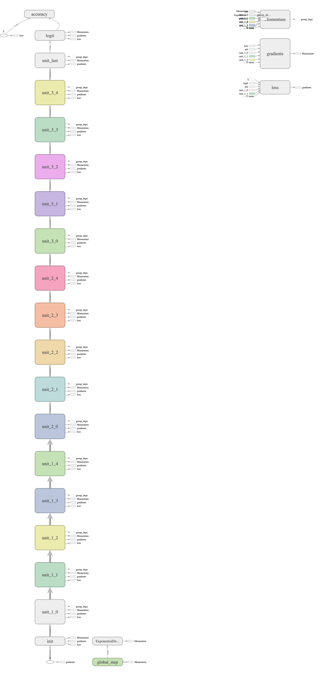

# ResNet
Deep Learning 과제 4번
*2015410115 송재민*

## Files

- `data_helpers.py`: Data Augmentation 등을 다루는 파일
- `resnet.py`: ResNet 모델 구조화를 위한 파일
- `resnet_train.py`: ResNet 모델 훈련을 위한 파일
- `resnet_eval.py`: ResNet 모델 테스트를 위한 파일
- `presets_and_results.py`: 모델에 사용할 하이퍼파라미터들과 결과를 저장함. (저장시 파이썬 `pickle`모듈을 사용하여 프리셋 객체 자체를 저장)
- `./INFOS/`에 프리셋 객체들이 저장되며, `resnet_train.py`에서 `val_accuracy`와 `training_time`등의 정보를 저장한 후 `resnet_eval.py`에서 읽어 `test_accuracy`등을 다시 저장한다.
- `tensorboard_run`: Tensorboard를 쉽게 실행하기 위해 작성한 파일
- `./runs`: 학습된 모델들이 저장되는 경로
- `./for_report/evaluation_report.xlsx`: 결과를 기록한 엑셀 파일 (Google Spreadsheet Link)

## Notice

- 10월 3일 새벽부터 모델 학습에 들어갔는데 자기 전에 기본 세팅 3개의 학습을 돌리고 잤지만 일어나보니 코드를 몇 줄 잘못 적어놔서 세팅 1번만 3번 학습하였다... Colab을 처음 사용해서 그런지 자잘한 오류가 많이 나서 모델을 많이 훈련시켜보지는 못했다.

## Model Graph

## Hyperparameter Tuning Report
