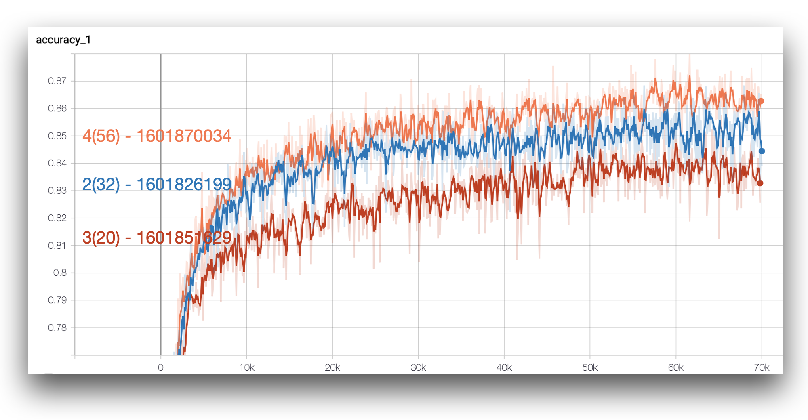
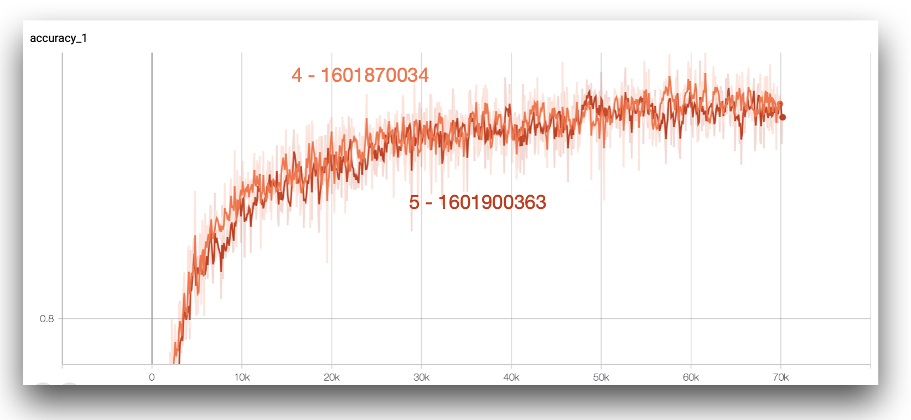
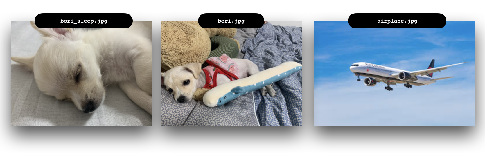

# ResNet
Deep Learning 과제 4번 *2015410115 송재민*

## Files

- `LastResNet.ipynb` Colab에서 구동시킨 파일 (`resnet_train.py` + `resnet_eval.py`)
- `data_helpers.py`: Data Augmentation 등을 다루는 파일
- `resnet.py`: ResNet 모델 구조화를 위한 파일
- `resnet_train.py`: ResNet 모델 훈련을 위한 파일
- `resnet_eval.py`: ResNet 모델 테스트를 위한 파일
- `presets_and_results.py`: 모델에 사용할 하이퍼파라미터들과 결과를 저장함. (저장시 파이썬 `pickle`모듈을 사용하여 프리셋 객체 자체를 저장)
- `./INFOS/pickles`에 프리셋 객체들이 저장더된다, `resnet_train.py`에서 `val_accuracy`와 `training_time`등의 정보를 피클 파일에 저장한 후 `resnet_eval.py`에서 읽어들여 `test_accuracy`등을 다시 저장한다.
- `./INFOS/train_overall.txt` 와 `./INFOS/eval_overall.txt` 에 학습 및 평가 결과가 로그로 저장된다.
- `tensorboard_run`: Tensorboard를 쉽게 실행하기 위해 작성한 파일
- `./runs`: 학습된 모델들이 저장되는 경로
- `./for_report/evaluation_report.xlsx`: 결과를 기록한 엑셀 파일 ([Google Spreadsheet Link](https://docs.google.com/spreadsheets/d/16SI9BuKWooU8JQZ0Ra0Siy4xChr4y6Vr5cF3kQ8Fi3w/edit?usp=sharing))

## Notice

- 구글 코랩 사용이 처음이고 학습이 너무 오래걸려서 많은 튜닝을 하지 못했습니다.

## Quick Answers

- X1 = `16`
- X2 = `32`
- X3 = `3`
- X4 = `X.get_shape().as_list()[-1]` (3)
- X5 = `filters[0]` (16)
- X6 = `[1, 1, 1, 1]`
- X7 = `3`
- X8 = `[1, 1, 1, 1]`
- X9 = `3`
- X10 = 상황에 따라 `[1, 1, 1, 1]` 혹은 `[1, 2, 2, 1]`

## Model Graph (ResNet30 기준)

## 

## Hyperparameter Tuning Report

### Preset 1, 2, 3 Result

1  → 2에서 `learning_rate_decay` 값을 1.0에서 0.96으로 디케이가 실제로 진행되도록 하였다. 최종 결과는 1번은 0.8592, 2번은 0.8564로 근소하게 1번이 성능이 더 좋았다. 아무래도 적절한 `learning_rate_decay` 값을 주지 못 한 것 같다. 

2  → 3번은 `num_residual_units` 를 5에서 3으로 바꾼 것이다. 그러니까 2번은 더 깊은 ResNet32모델이고, 3번은 더 얕은 ResNet20모델이다. 예상대로 더 깊은 2번 모델의 성능이 더 좋았다. 

우선 가장 좋은 성능을 보인 것은 1번이지만, Learning Rate Decay가 적용된 2번을 바탕으로 파라미터 튜닝을 해 나가보기로 했다. 우선 처음의 방향 더 깊게 레이어를 쌓아보자는 것이었다.

### `num_residual_units`

2  → 4번은 `num_residual_units` 를 5에서 9로 바꾼 것이다. 그러니까 ResNet32에서 ResNet56이 되었다고 볼 수 있겠다.

`num_residual_units`를 바꾼 것 끼리의 비교이다. `test_accuracy` 는 3(0.851) < 2(0.8564) <  4(0.8659)가 나왔다. 역시 깊이가 깊어질 수록 성능이 좋아지는 것 같다.

### `lr_decay`

4번을 기준으로 하여 `lr_decay` 값을 다르게 줘 보았다. 5번은 `lr_decay` 값이 0.90인데, 학습 시간이 480분이나 걸렸지만 성능은 4번에 비해 안좋게 나와서 당황스럽다. `lr_decay` 값을 0.9로 줘본 까닭은 지난 3번 과제에서 `lr_decay` 값을 0.90으로 주었을 때가 가장 성능이 좋게 나왔기 때문이다.

## Inference with model preset 4 (timestamp = 1601870034)

좀 더 좋은 성능을 지닌 모델로 실제 이미지를 추론해보고 싶었지만, 일단은 과제를 끝마치기 위해 생성된 프리셋 4번(타임스탬프 1601870034)모델로 진행하였다.`data_helpers.py`의 이미지 리사이즈 기능을 사용하기 위해 `scipy` 모듈을 삭제한 후 1.1.0 버전으로 재설치 해 주었다.

총 3가지의 이미지를 넣어 보았는데, 

- `bori_sleep.jpg` : `cat`으로 예측, 고양이를 닮기는 한 것 같다.
- `bori.jpg`: `automobile`로 예측(...). 아마도 사진이 복잡해서 강아지의 특징을 뽑기 힘들어서 그런 것 같다.
- `airplane.jpg`: `airplane`으로 예측

3개 중 1개만을 맞추었지만, 비행기 사진을 비행기라고 맞춘 것이 정말로 신기하다.